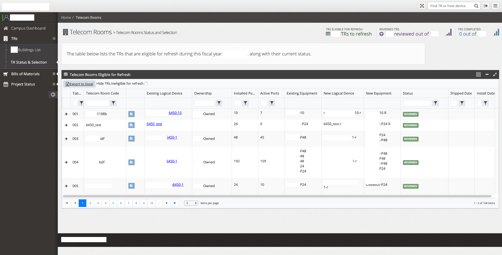
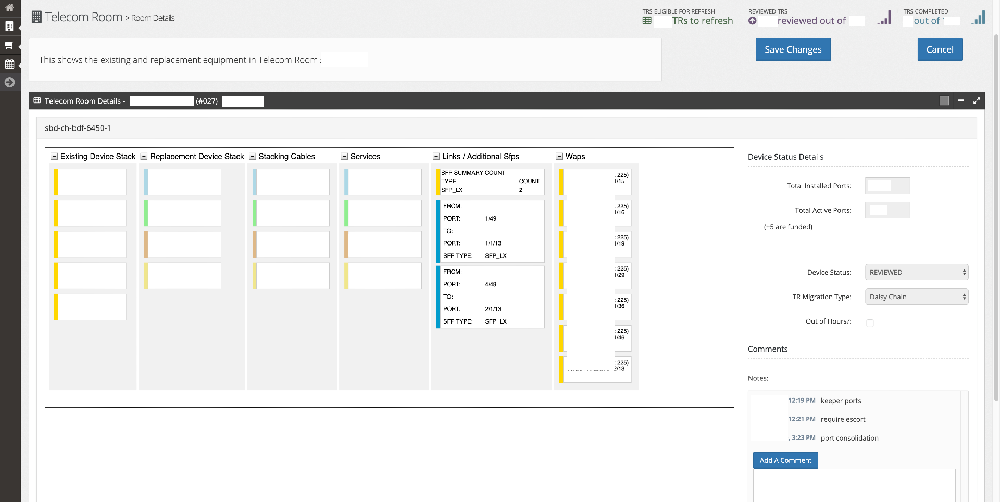
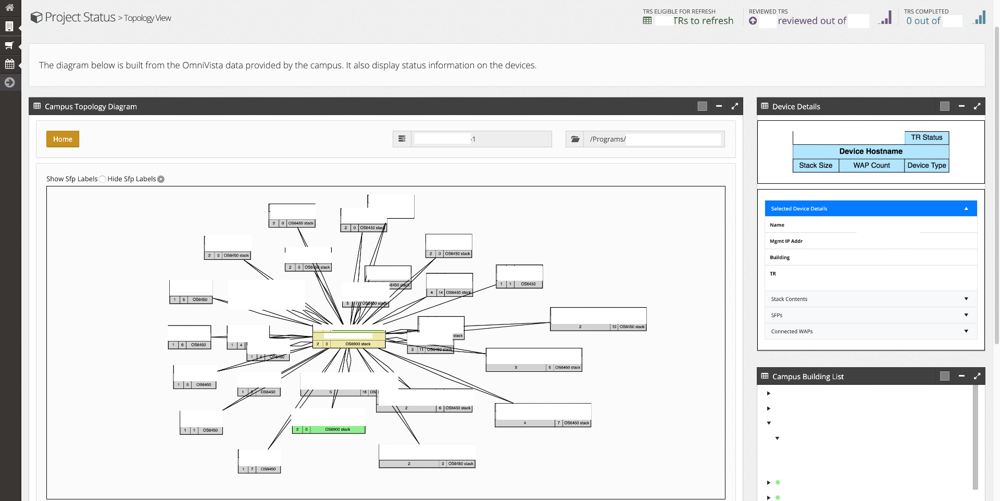
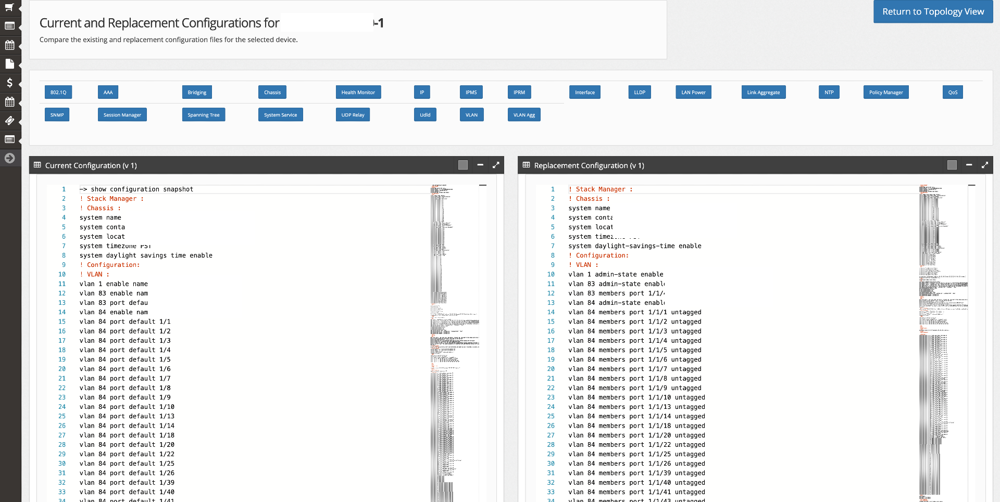

## Overview

Program Director for multi-year university campus network refresh program with over 100,000 campus infrastructure components. Responsible for the overall technical program management, including strategy, schedule, and scope. Managed a team of network consultants and network engineers, and contractors to deliver the program on time and within budget. Developed and maintained relationships with key stakeholders, including chancellor's office staff, and campus administrations.

Worked with university IT staff to develop and implement a network refresh strategy that met the needs of the university's academic and administrative departments. Developed detailed technical approach, work breakdown task templates for designs, staging, configuration, deployment, migration, and turn-up for all phases of the campus-level refresh project.

Led the initial technical migration to a common network standard based on Cisco and Juniper equipment, followed by two subsequent network refresh programs. When the initial vendor contract expired, supported a university RFI/RFP process to select the subsequent vendor for the next phase of the program. When new vendors were selected, led the transition to the new vendor, including the development of new network designs, configurations, and migration plans.

Developed numerous tools and processes to support the program, including

- a network configuration migration tool to automate and standardize the generation of configuration files for the new equipment.

- a campus migration inventory support tool to automate and standardize the generation of new equipment parts, including design validation, and links into the device configuration generator.

- modifying [nodeRED](https://nodered.org/) to support the program's needs, including the development of custom nodes to support the program's requirements.

## Exhibited Skills

- Program Management Office (PMO) level technical program management including CXO level reporting
- Recruiting, hiring, and managing a team of network and security consultants and engineers
- CCIE-level technical expertise in network design, configuration, and troubleshooting
- Ability to architect and design complex network solutions with standardization, automation, and efficient operations
- Ability to develop bespoke tools and processes to support complex infrastructure projects

## Details

## Campus Network Refresh Inventory Tool UI Screenshots

I was the sole developer of this tool. It consisted of an Angular-based web client connecting to a cloud-deployed .NET Core backend with a SQL server database. The tool was used to generate an entire inventory of all network devices for a campus network refresh, including core, distribution, and access layers. This was auto-generated by applying migration design rules against existing device inventory data.

The generated inventory was then reviewed with the campus IT staff to validate the design and identify any missing or incorrect data. The tool was used to track the status of each device on its journey from Bill Of Materials line item, through ordering, shipping, and initial configuration, ending with successful turn-up in a campus closet or data center.

A few screenshots of the tool are shown below.

### Campus Closet Inventory View

This (partially-redacted) page shows a summary of the existing and replacement equipment in one closet on campus. It provides an active port count analysis which was part of the migration design rules. The tool was used to generate a detailed inventory of all devices in the closet, including the device type, model, serial number, and port count. Links to the device configuration files were also provided. A device-specific finite state machine persisted to the database was used to track the status of each device in the migration process.

    

### Campus Closet Details View

This (partially-redacted) page shows the rack level details for a closet and includes inventory for the cables, associated services, and fiber connectors required for each device.

    

### Campus Topology Diagram View

This (heavily-redacted) page was auto-generated from the connectivity matrix for the proposed campus network. It is a core-level view that supports clickable drill down (to the next - distribution - layer via the green icons) and shows all devices directly connected to this core device. Links from the device names go to the device configuration files.

    

### Device Configuration Editor and Difference View

This (partially-redacted) page shows the current device configuration file on the left and the proposed configuration file on the right. The tool was used to generate the proposed configuration file based on the migration design rules and the existing configuration file. The tool was also used to generate a difference report between the two files to identify any changes required to the proposed configuration. The replacement file was editable in the tool and could be saved back to the database for later electronic distribution to the implementation engineer.

    

<!-- Modal Structure -->

    

